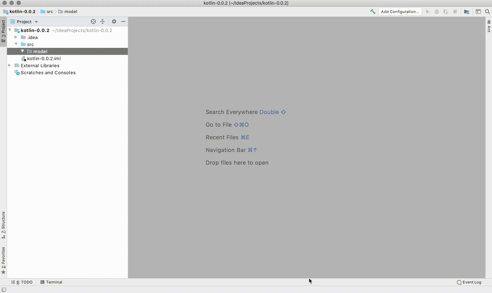

# kotlin-mybatis-entity-generator

<!-- Plugin description -->
Generate a mapping class for a single table.

<!-- Plugin description end -->

## Installation

- Using IDE built-in plugin system:

  <kbd>Preferences</kbd> > <kbd>Plugins</kbd> > <kbd>Marketplace</kbd> > <kbd>Search for "kotlin-mybatis-entity-generator"</kbd> >
  <kbd>Install Plugin</kbd>

- Manually:

  Download the [latest release](https://github.com/shuntakeuch1/kotlin-mybatis-entity-generator/releases/latest) and install it manually using
  <kbd>Preferences</kbd> > <kbd>Plugins</kbd> > <kbd>⚙️</kbd> > <kbd>Install plugin from disk...</kbd>

## Support data type

<table>
  <thead>
    <tr>
      <th> Kotlin</th>
      <th> MySQL</th>
    </tr>
  </thead>
  <tbody>
    <tr>
      <td>Int</td>
      <td>TINYINT,SMALLINT,MEDIUMINT,INT,BIGINT</td>
    </tr>
    <tr>
      <td>LocalDatetime</td>
      <td>DATE,TIME,DATETIME,TIMESTAMP,YEAR</td>
    </tr>
    <tr>
      <td rowspan="4">String</td>
      <td>CHAR,VARCHAR,BINARY,VARBINARY</td>
    </tr>
    <tr>
      <td>TINYBLOB,BLOB,MEDIUMBLOB,LONGBLOB</td>
    </tr>
    <tr>
      <td>TINYTEXT,TEXT,MEDIUMTEXT,LONGTEXT</td>
    </tr>
    <tr>
      <td>json</td>
    </tr>
  </tbody>
</table>

PostgreSQL(coming soon) ...

---
Plugin based on the [IntelliJ Platform Plugin Template][template].

[template]: https://github.com/JetBrains/intellij-platform-plugin-template
